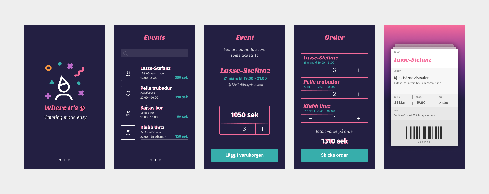

# Indivuduell Examination - Where It's @

Dags att rocka koden! Din mission är att bygga frontenden till Where it’s @ – en app där lokala musikevent får stå i rampljuset.
Med React som ditt instrument ska du komponera en upplevelse som får användarna att klicka vidare till nästa spelning med ett leende.
Komponenter, props och state – tänk modulärt, tänk snyggt, tänk “det här skulle jag själv vilja använda”.
Du bygger alltså inte bara ett gränssnitt – du bygger pulsen i stadens musikscen.

## Uppdrag

Ditt uppdrag är att koda ihop en frontend till biljettjänsten _Where its @_. Den ska se ut enligt nedan mockup. Du har också tillgång till [Figma-länk](https://www.figma.com/file/vcgWPPy2q44oZZ2eORL1wB/Where-its-light?node-id=0%3A1) för exportering av assets, färger, kika fonter etc.



## Tekniska krav för godkänt

Du skall i denna uppgift för att få godkänt visa att du behärskar följande tekniker och delar inom React:

- Pages & Components
- useState & useEffect
- Props
- API-hantering
- Routing mellan Pages
- Avancerad statehantering med Zustand

## Krav för väl godkänt

Du skall välja ut ytterligare 3 st externa bibliotek, som vi inte gått igenom i klassen och som du läser på om och implementerar i din applikation. Utöver detta så beskriver du i din _README.md_-fil, hur dessa hookar/bibliotek fungerar, samt varför du tycker att de passar just din applikation. För VG måste du även ha en god struktur på din applikation, med god uppdelning i Pages och Komponenter. Utöver det så måste ni inte dela upp koden i en massa egna custom hooks och dylikt, även om det såklart är tillåtet om man vill det.

### Tips på externa Bibliotek

- Material UI
- Chakra UI
- Swiper
- Fontawesome
- Icons8
- Framer Motion
- Redux (kan användas istället för Zutand)
- TanStack React Query
- react-confetti

React-router-dom, axios osv som vi gått igenom under lektioner räknas inte. Om ni väljer lite "tyngre" bibliotek (alltså inte ikonbibliotek) så kan ni höra av er till mig för då kanske 2 st räcker. 

## Övriga krav

- Er app måste inte vara pixel-perfekt mot skissen, men ni måste ha en enhetlig, responsiv design
- Appen skall se bra ut på alla skärmstorlekar mellan 375px - 500px
- Tillgänglighetskontroll/anpassning skall göras innan inlämning
- Sidan får aldrig krascha
- När en beställing gjorts skall en biljett skapas där ni genererar fram ett biljettID på 5 tecken (endast STORA BOKSTÄVER och siffror tillåtna), en Sektion och en sittplats. Vid köp av flera biljetter till ett och samma evenemang skall Sektionen vara samma på alla biljetter för det eventet, och sittplatserna skall vara bredvid varandra.

## Övrig info

Figma-skissen ger inte en fullständig överblick över hur projektet bör byggas. [Se tillhörande introduktionsfilm]() där det förklaras vilka tolkningar ni kan få lov att göra. (Laddas upp efter genomgången med distansklassen).

## Resurser

- Figma-skissen [hittar ni här](https://www.figma.com/file/vcgWPPy2q44oZZ2eORL1wB/Where-its-light?node-id=0%3A1)

- Ett av typsnitten som används i skissen, Sansita One, [hittar ni här](https://www.1001fonts.com/sansita-one-font.html)

- Som vanligt har ni tillgång till datan i mitt API genom nedanstående anrop:

```
GET https://santosnr6.github.io/Data/events.json
```

## Inlämning

Inlämning sker som vanligt i form av att en länk till ditt gitrepo laddas up på Azomo, senast kl 23:59 den 9/5.
